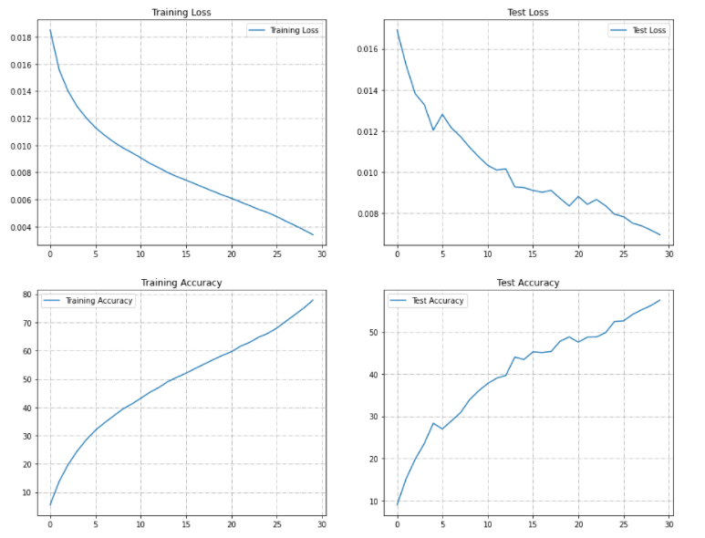
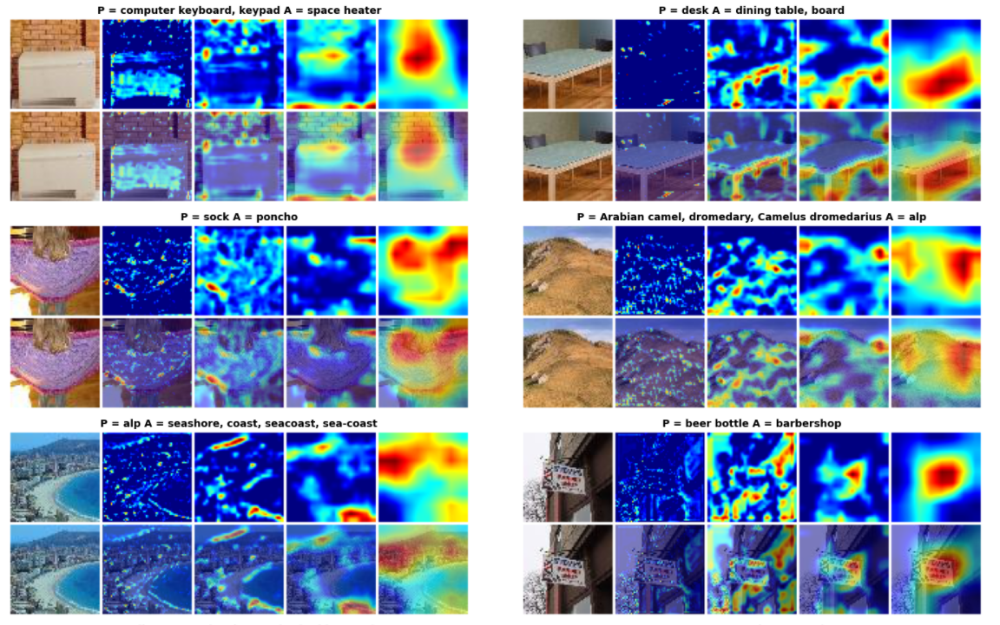

## **PART - A**

### **Aim**

- ✅ Download the TINY IMAGENET dataset. 
- ✅ Train ResNet18 on this dataset (70/30 split) for 50 Epochs. Target 50%+ Validation Accuracy. 
- ✅ Submit Results. 
          
        
### **Model Summary**
```
----------------------------------------------------------------
        Layer (type)               Output Shape         Param #
================================================================
            Conv2d-1           [-1, 64, 64, 64]           1,728
       BatchNorm2d-2           [-1, 64, 64, 64]             128
            Conv2d-3           [-1, 64, 64, 64]          36,864
       BatchNorm2d-4           [-1, 64, 64, 64]             128
            Conv2d-5           [-1, 64, 64, 64]          36,864
       BatchNorm2d-6           [-1, 64, 64, 64]             128
        BasicBlock-7           [-1, 64, 64, 64]               0
            Conv2d-8           [-1, 64, 64, 64]          36,864
       BatchNorm2d-9           [-1, 64, 64, 64]             128
           Conv2d-10           [-1, 64, 64, 64]          36,864
      BatchNorm2d-11           [-1, 64, 64, 64]             128
       BasicBlock-12           [-1, 64, 64, 64]               0
           Conv2d-13          [-1, 128, 32, 32]          73,728
      BatchNorm2d-14          [-1, 128, 32, 32]             256
           Conv2d-15          [-1, 128, 32, 32]         147,456
      BatchNorm2d-16          [-1, 128, 32, 32]             256
           Conv2d-17          [-1, 128, 32, 32]           8,192
      BatchNorm2d-18          [-1, 128, 32, 32]             256
       BasicBlock-19          [-1, 128, 32, 32]               0
           Conv2d-20          [-1, 128, 32, 32]         147,456
      BatchNorm2d-21          [-1, 128, 32, 32]             256
           Conv2d-22          [-1, 128, 32, 32]         147,456
      BatchNorm2d-23          [-1, 128, 32, 32]             256
       BasicBlock-24          [-1, 128, 32, 32]               0
           Conv2d-25          [-1, 256, 16, 16]         294,912
      BatchNorm2d-26          [-1, 256, 16, 16]             512
           Conv2d-27          [-1, 256, 16, 16]         589,824
      BatchNorm2d-28          [-1, 256, 16, 16]             512
           Conv2d-29          [-1, 256, 16, 16]          32,768
      BatchNorm2d-30          [-1, 256, 16, 16]             512
       BasicBlock-31          [-1, 256, 16, 16]               0
           Conv2d-32          [-1, 256, 16, 16]         589,824
      BatchNorm2d-33          [-1, 256, 16, 16]             512
           Conv2d-34          [-1, 256, 16, 16]         589,824
      BatchNorm2d-35          [-1, 256, 16, 16]             512
       BasicBlock-36          [-1, 256, 16, 16]               0
           Conv2d-37            [-1, 512, 8, 8]       1,179,648
      BatchNorm2d-38            [-1, 512, 8, 8]           1,024
           Conv2d-39            [-1, 512, 8, 8]       2,359,296
      BatchNorm2d-40            [-1, 512, 8, 8]           1,024
           Conv2d-41            [-1, 512, 8, 8]         131,072
      BatchNorm2d-42            [-1, 512, 8, 8]           1,024
       BasicBlock-43            [-1, 512, 8, 8]               0
           Conv2d-44            [-1, 512, 8, 8]       2,359,296
      BatchNorm2d-45            [-1, 512, 8, 8]           1,024
           Conv2d-46            [-1, 512, 8, 8]       2,359,296
      BatchNorm2d-47            [-1, 512, 8, 8]           1,024
       BasicBlock-48            [-1, 512, 8, 8]               0
           Linear-49                  [-1, 200]         102,600
================================================================
Total params: 11,271,432
Trainable params: 11,271,432
Non-trainable params: 0
----------------------------------------------------------------
Input size (MB): 0.05
Forward/backward pass size (MB): 45.00
Params size (MB): 43.00
Estimated Total Size (MB): 88.05
----------------------------------------------------------------
```
### **Training Logs**


```
0%|          | 0/301 [00:00<?, ?it/s]EPOCH: 1 LR: 0.002
/usr/local/lib/python3.7/dist-packages/torch/utils/data/dataloader.py:481: UserWarning: This DataLoader will create 4 worker processes in total. Our suggested max number of worker in current system is 2, which is smaller than what this DataLoader is going to create. Please be aware that excessive worker creation might get DataLoader running slow or even freeze, lower the worker number to avoid potential slowness/freeze if necessary.
  cpuset_checked))
Loss=4.193744659423828 Batch_id=300 Accuracy=5.55: 100%|██████████| 301/301 [02:38<00:00,  1.90it/s]
  0%|          | 0/301 [00:00<?, ?it/s]
Test set: Average loss: 0.0169, Accuracy: 2974/33000 (9.01%)

EPOCH: 2 LR: 0.0038005982053838485
Loss=3.761247158050537 Batch_id=300 Accuracy=13.85: 100%|██████████| 301/301 [02:38<00:00,  1.90it/s]
  0%|          | 0/301 [00:00<?, ?it/s]
Test set: Average loss: 0.0152, Accuracy: 5008/33000 (15.18%)

EPOCH: 3 LR: 0.005601196410767697
Loss=3.4212605953216553 Batch_id=300 Accuracy=19.84: 100%|██████████| 301/301 [02:38<00:00,  1.90it/s]
  0%|          | 0/301 [00:00<?, ?it/s]
Test set: Average loss: 0.0138, Accuracy: 6542/33000 (19.82%)

EPOCH: 4 LR: 0.007401794616151546
Loss=3.300711154937744 Batch_id=300 Accuracy=24.61: 100%|██████████| 301/301 [02:37<00:00,  1.91it/s]
  0%|          | 0/301 [00:00<?, ?it/s]
Test set: Average loss: 0.0133, Accuracy: 7768/33000 (23.54%)

EPOCH: 5 LR: 0.009202392821535395
Loss=3.1839206218719482 Batch_id=300 Accuracy=28.59: 100%|██████████| 301/301 [02:38<00:00,  1.90it/s]
  0%|          | 0/301 [00:00<?, ?it/s]
Test set: Average loss: 0.0120, Accuracy: 9358/33000 (28.36%)

EPOCH: 6 LR: 0.011002991026919245
Loss=2.993387460708618 Batch_id=300 Accuracy=31.91: 100%|██████████| 301/301 [02:37<00:00,  1.91it/s]
  0%|          | 0/301 [00:00<?, ?it/s]
Test set: Average loss: 0.0128, Accuracy: 8913/33000 (27.01%)

EPOCH: 7 LR: 0.012803589232303092
Loss=2.7723305225372314 Batch_id=300 Accuracy=34.53: 100%|██████████| 301/301 [02:37<00:00,  1.91it/s]
  0%|          | 0/301 [00:00<?, ?it/s]
Test set: Average loss: 0.0122, Accuracy: 9544/33000 (28.92%)

EPOCH: 8 LR: 0.01460418743768694
Loss=2.484865188598633 Batch_id=300 Accuracy=36.93: 100%|██████████| 301/301 [02:37<00:00,  1.91it/s]
  0%|          | 0/301 [00:00<?, ?it/s]
Test set: Average loss: 0.0117, Accuracy: 10183/33000 (30.86%)

EPOCH: 9 LR: 0.01640478564307079
Loss=2.4606924057006836 Batch_id=300 Accuracy=39.35: 100%|██████████| 301/301 [02:37<00:00,  1.91it/s]
  0%|          | 0/301 [00:00<?, ?it/s]
Test set: Average loss: 0.0112, Accuracy: 11199/33000 (33.94%)

EPOCH: 10 LR: 0.01820538384845464
Loss=2.6643524169921875 Batch_id=300 Accuracy=41.15: 100%|██████████| 301/301 [02:37<00:00,  1.91it/s]
  0%|          | 0/301 [00:00<?, ?it/s]
Test set: Average loss: 0.0108, Accuracy: 11896/33000 (36.05%)

EPOCH: 11 LR: 0.01999671096345515
Loss=2.326511859893799 Batch_id=300 Accuracy=43.18: 100%|██████████| 301/301 [02:38<00:00,  1.90it/s]
  0%|          | 0/301 [00:00<?, ?it/s]
Test set: Average loss: 0.0103, Accuracy: 12468/33000 (37.78%)

EPOCH: 12 LR: 0.01900671096345515
Loss=2.2425622940063477 Batch_id=300 Accuracy=45.30: 100%|██████████| 301/301 [02:37<00:00,  1.91it/s]
  0%|          | 0/301 [00:00<?, ?it/s]
Test set: Average loss: 0.0101, Accuracy: 12887/33000 (39.05%)

EPOCH: 13 LR: 0.01801671096345515
Loss=2.0580687522888184 Batch_id=300 Accuracy=47.00: 100%|██████████| 301/301 [02:37<00:00,  1.91it/s]
  0%|          | 0/301 [00:00<?, ?it/s]
Test set: Average loss: 0.0102, Accuracy: 13103/33000 (39.71%)

EPOCH: 14 LR: 0.01702671096345515
Loss=2.1617488861083984 Batch_id=300 Accuracy=49.09: 100%|██████████| 301/301 [02:37<00:00,  1.91it/s]
  0%|          | 0/301 [00:00<?, ?it/s]
Test set: Average loss: 0.0093, Accuracy: 14540/33000 (44.06%)

EPOCH: 15 LR: 0.01603671096345515
Loss=2.0399906635284424 Batch_id=300 Accuracy=50.62: 100%|██████████| 301/301 [02:37<00:00,  1.91it/s]
  0%|          | 0/301 [00:00<?, ?it/s]
Test set: Average loss: 0.0092, Accuracy: 14351/33000 (43.49%)

EPOCH: 16 LR: 0.01504671096345515
Loss=1.9319827556610107 Batch_id=300 Accuracy=52.05: 100%|██████████| 301/301 [02:37<00:00,  1.91it/s]
  0%|          | 0/301 [00:00<?, ?it/s]
Test set: Average loss: 0.0091, Accuracy: 14944/33000 (45.28%)

EPOCH: 17 LR: 0.014056710963455149
Loss=1.6608678102493286 Batch_id=300 Accuracy=53.70: 100%|██████████| 301/301 [02:37<00:00,  1.91it/s]
  0%|          | 0/301 [00:00<?, ?it/s]
Test set: Average loss: 0.0090, Accuracy: 14892/33000 (45.13%)

EPOCH: 18 LR: 0.01306671096345515
Loss=1.881971001625061 Batch_id=300 Accuracy=55.25: 100%|██████████| 301/301 [02:38<00:00,  1.90it/s]
  0%|          | 0/301 [00:00<?, ?it/s]
Test set: Average loss: 0.0091, Accuracy: 14973/33000 (45.37%)

EPOCH: 19 LR: 0.012076710963455148
Loss=1.6770224571228027 Batch_id=300 Accuracy=56.84: 100%|██████████| 301/301 [02:38<00:00,  1.90it/s]
  0%|          | 0/301 [00:00<?, ?it/s]
Test set: Average loss: 0.0087, Accuracy: 15783/33000 (47.83%)

EPOCH: 20 LR: 0.011086710963455149
Loss=1.6732585430145264 Batch_id=300 Accuracy=58.30: 100%|██████████| 301/301 [02:37<00:00,  1.91it/s]
  0%|          | 0/301 [00:00<?, ?it/s]
Test set: Average loss: 0.0084, Accuracy: 16115/33000 (48.83%)

EPOCH: 21 LR: 0.010096710963455147
Loss=1.6595666408538818 Batch_id=300 Accuracy=59.64: 100%|██████████| 301/301 [02:37<00:00,  1.91it/s]
  0%|          | 0/301 [00:00<?, ?it/s]
Test set: Average loss: 0.0088, Accuracy: 15705/33000 (47.59%)

EPOCH: 22 LR: 0.00910671096345515
Loss=1.4669309854507446 Batch_id=300 Accuracy=61.55: 100%|██████████| 301/301 [02:37<00:00,  1.91it/s]
  0%|          | 0/301 [00:00<?, ?it/s]
Test set: Average loss: 0.0084, Accuracy: 16095/33000 (48.77%)

EPOCH: 23 LR: 0.008116710963455148
Loss=1.6893534660339355 Batch_id=300 Accuracy=62.91: 100%|██████████| 301/301 [02:37<00:00,  1.91it/s]
  0%|          | 0/301 [00:00<?, ?it/s]
Test set: Average loss: 0.0087, Accuracy: 16108/33000 (48.81%)

EPOCH: 24 LR: 0.00712671096345515
Loss=1.480400800704956 Batch_id=300 Accuracy=64.75: 100%|██████████| 301/301 [02:37<00:00,  1.91it/s]
  0%|          | 0/301 [00:00<?, ?it/s]
Test set: Average loss: 0.0084, Accuracy: 16445/33000 (49.83%)

EPOCH: 25 LR: 0.006136710963455149
Loss=1.2107820510864258 Batch_id=300 Accuracy=66.07: 100%|██████████| 301/301 [02:37<00:00,  1.91it/s]
  0%|          | 0/301 [00:00<?, ?it/s]
Test set: Average loss: 0.0080, Accuracy: 17323/33000 (52.49%)

EPOCH: 26 LR: 0.005146710963455148
Loss=1.2747420072555542 Batch_id=300 Accuracy=67.97: 100%|██████████| 301/301 [02:37<00:00,  1.91it/s]
  0%|          | 0/301 [00:00<?, ?it/s]
Test set: Average loss: 0.0078, Accuracy: 17377/33000 (52.66%)

EPOCH: 27 LR: 0.00415671096345515
Loss=1.1309386491775513 Batch_id=300 Accuracy=70.35: 100%|██████████| 301/301 [02:37<00:00,  1.91it/s]
  0%|          | 0/301 [00:00<?, ?it/s]
Test set: Average loss: 0.0075, Accuracy: 17878/33000 (54.18%)

EPOCH: 28 LR: 0.0031667109634551487
Loss=1.0643219947814941 Batch_id=300 Accuracy=72.68: 100%|██████████| 301/301 [02:37<00:00,  1.91it/s]
  0%|          | 0/301 [00:00<?, ?it/s]
Test set: Average loss: 0.0074, Accuracy: 18242/33000 (55.28%)

EPOCH: 29 LR: 0.002176710963455151
Loss=1.030601143836975 Batch_id=300 Accuracy=75.11: 100%|██████████| 301/301 [02:38<00:00,  1.90it/s]
  0%|          | 0/301 [00:00<?, ?it/s]
Test set: Average loss: 0.0072, Accuracy: 18565/33000 (56.26%)

EPOCH: 30 LR: 0.0011867109634551495
Loss=0.9878716468811035 Batch_id=300 Accuracy=77.83: 100%|██████████| 301/301 [02:38<00:00,  1.90it/s]

Test set: Average loss: 0.0070, Accuracy: 18991/33000 (57.55%)


```

### **Accuracy Graphs**       


### **GradCam on MisClassified Images**        

