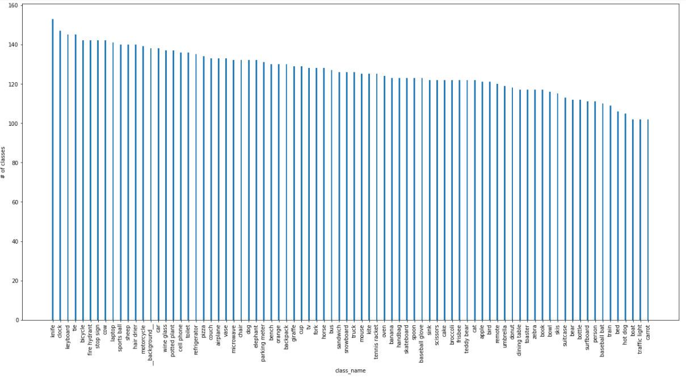
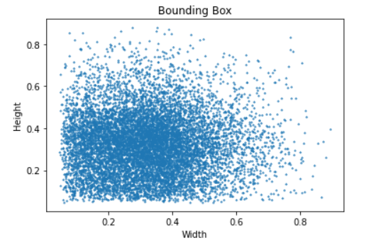
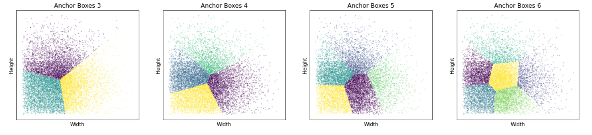
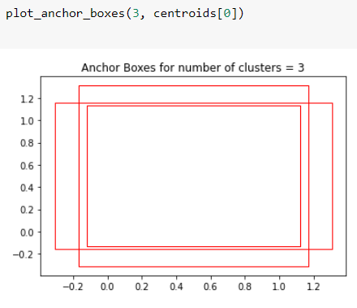
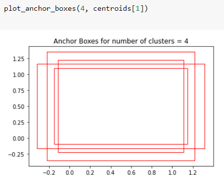
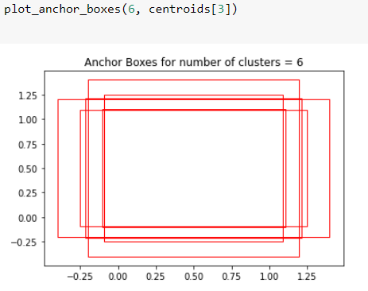

## **PART - B**

### **Aim**

- ✅ Download coc.txt file. Learn how COCO object detection dataset's schema is. 
- ✅ Identify these things for this dataset:
  - readme data for class distribution (along with the class names) along with a graph 
  - Calculate the Anchor Boxes for k = 3, 4, 5, 6 and draw them.
  - Share the calculations for both via a notebook uploaded on your GitHub Repo
### List of classes

> coco_class_map = {0: u'__background__',
 1: u'person',
 2: u'bicycle',
 3: u'car',
 4: u'motorcycle',
 5: u'airplane',
 6: u'bus',
 7: u'train',
 8: u'truck',
 9: u'boat',
 10: u'traffic light',
 11: u'fire hydrant',
 12: u'stop sign',
 13: u'parking meter',
 14: u'bench',
 15: u'bird',
 16: u'cat',
 17: u'dog',
 18: u'horse',
 19: u'sheep',
 20: u'cow',
 21: u'elephant',
 22: u'bear',
 23: u'zebra',
 24: u'giraffe',
 25: u'backpack',
 26: u'umbrella',
 27: u'handbag',
 28: u'tie',
 29: u'suitcase',
 30: u'frisbee',
 31: u'skis',
 32: u'snowboard',
 33: u'sports ball',
 34: u'kite',
 35: u'baseball bat',
 36: u'baseball glove',
 37: u'skateboard',
 38: u'surfboard',
 39: u'tennis racket',
 40: u'bottle',
 41: u'wine glass',
 42: u'cup',
 43: u'fork',
 44: u'knife',
 45: u'spoon',
 46: u'bowl',
 47: u'banana',
 48: u'apple',
 49: u'sandwich',
 50: u'orange',
 51: u'broccoli',
 52: u'carrot',
 53: u'hot dog',
 54: u'pizza',
 55: u'donut',
 56: u'cake',
 57: u'chair',
 58: u'couch',
 59: u'potted plant',
 60: u'bed',
 61: u'dining table',
 62: u'toilet',
 63: u'tv',
 64: u'laptop',
 65: u'mouse',
 66: u'remote',
 67: u'keyboard',
 68: u'cell phone',
 69: u'microwave',
 70: u'oven',
 71: u'toaster',
 72: u'sink',
 73: u'refrigerator',
 74: u'book',
 75: u'clock',
 76: u'vase',
 77: u'scissors',
 78: u'teddy bear',
 79: u'hair drier',
 80: u'toothbrush'}

### **Graph for Class Distribution**

There are 80 categories in the provided dataset and its distribution is shown below:

### **Bounding Box**

A bounding box is a rectangle that surrounds an object, that specifies its position, class and confidence(how likely it is to be at that location). Bounding boxes are mainly used in the task of object detection, where the aim is identifying the position and type of multiple objects in the image.          

### **Anchor Box and K-values**

Anchor boxes are nothing but template bounding boxes. Object detection models utilize the anchor boxes to make beter bounding box predictions. 

**Anchor Box Cluster**       

**Anchor Boxes for different K values**

When K = 3    
   

When K = 4    
     

When K = 5     
     

When K = 6  
     
